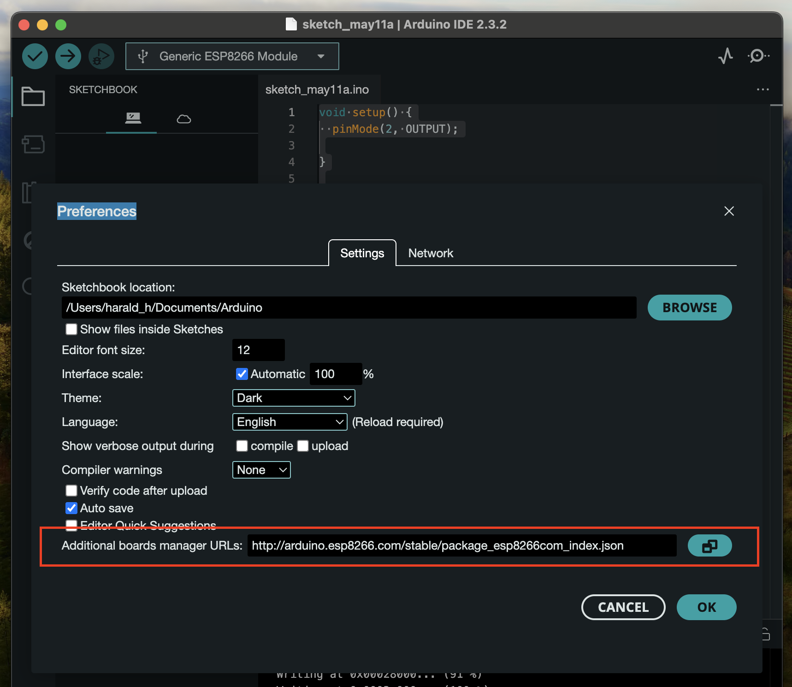
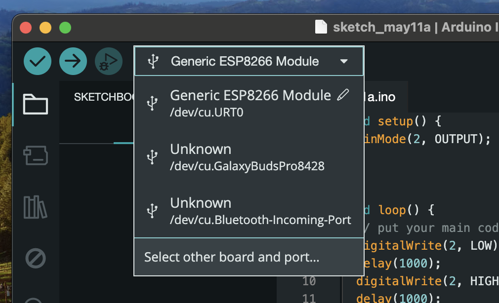
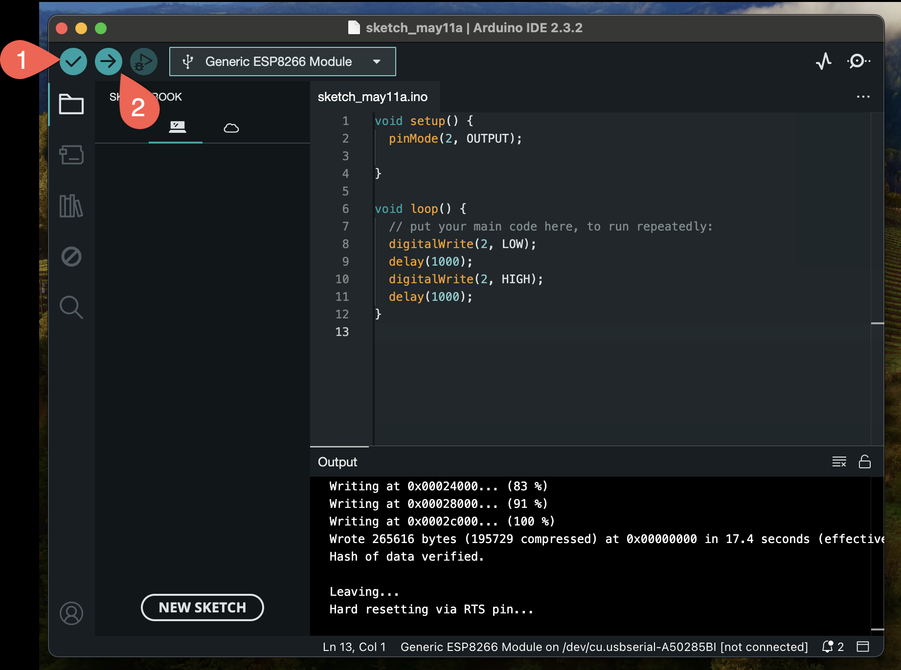

# AZ-Envy ESP8266-12F Environment Board

## Getting Started

To get started you'll need the following equipment:
- AZ-Envy Board with ESP8266-12F Microcontroller
- FT232-AZ USB Mini to Serial Adapter
- 6 Female to Female connection wires
- Mini USB to USB cable 
- Micro USB power adapter

### Get Arduino IDE

Download and install the Arduino IDE from [here](https://www.arduino.cc/en/software).

### Setup Board-Management URL

After installing the Arduino IDE you must set the following Board 
Management URL http://arduino.esp8266.com/stable/package_esp8266com_index.json under *Preferences*

### Connecting ESP8266-12F to FT232-AZ

Connect the 6 pins of the ESP8266-12F to FT232-AZ

| Pin | Description |
|-----|-------------|
| GND | Power Supply (-) |
| CTS | Clear to send |
| VCC | Power Supply (+) |
| TX | Transmitt |
| RX | Receive |
| DTR | Data Terminal Ready |

### Flashing the ESP8266-12F

1. Copy the hello-world_esp8266.ino code to your Arduino IDE. 
2. Connect the FT232-AZ Serial Adapter with Mini-USB to your computer USB port.
3. Connect the Micro-USB power adapter to AZ-Envy Micro-USB port
4. Select the Board in the Arduino IDE (Board Generic ESP8266)

5. First press button (1) to check if your code compiles.
6. Then press button (2) to start flashing the ESP8266
7. Only pressing the FLASH key while uploading will **not** be successful. **The trick is:** The FLASH key must be pressed when the power supply is established. Therefore first press the RESET button, then the FLASH button, then release RESET and finally release FLASH.

## Starting a new sketch in Arduino IDE

Every sketch must be in an own folder to work with ArduinoIDE. The file extension is .ino

## Installing libraries

Necessary libraries for this project are:

- ClosedCube_SHT31_D
- ArdunioJSON
- ArduinoUniqueID

You must install these libraries via the library button on the left side of the ArduinoIDE

## Known Issue with SHT_31_D Library

When trying to compile (verify) the project the first time a failure occurs. 
This is a known issue with the library [SHT31_D Issue #5](https://github.com/closedcube/ClosedCube_SHT31D_Arduino/issues/5).

To fix it open the installed library folder in a C++ IDE of your choice and edit the
ClosedCube_SHT31_D.cpp file. Just add the missing `return` statement in line 55:
`return returnError(error)`. Save the file and then you can compile and flash the project
to your AZ-Envy.

